# 🛡️ CodeAlpha - Secure Coding Review

<p align="center">


<br>


<p align="center">

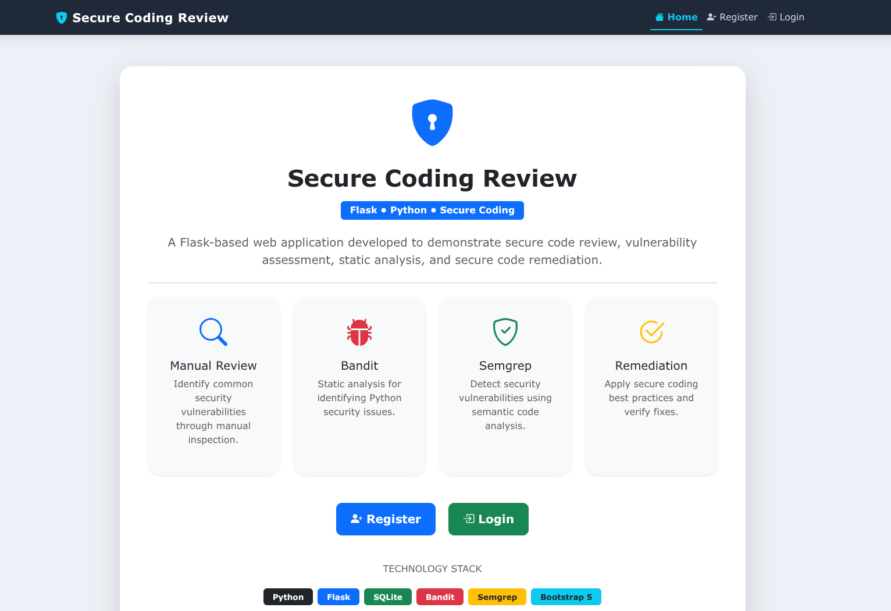

</p>

</p>

A secure **Flask-based web application** developed for the **CodeAlpha Cyber Security Internship** to demonstrate modern secure coding practices.

The project implements **secure authentication, password hashing, SQL Injection prevention, Role-Based Access Control (RBAC), secure file upload,** and **static security analysis using Bandit and Semgrep**.

---

# 📑 Table of Contents

- [Features](#features)
- [Installation](#installation)
- [Usage](#usage)
- [Screenshots](#screenshots)
- [Project Structure](#project-structure)
- [Security Features](#security-features)
- [Security Analysis](#security-analysis)
- [Branches](#branches)
- [Technologies Used](#technologies-used)
- [Future Improvements](#future-improvements)
- [Contributing](#contributing)
- [License](#license)
- [Author](#author)
- [Support](#support)

---

# 🚀 Features

- 🔐 Secure User Registration & Login
- 🔑 Password Hashing (Werkzeug)
- 👤 User Profile
- 🔍 Secure User Search
- 📂 Secure File Upload
- 🛡️ SQL Injection Prevention
- 🔒 Role-Based Access Control (RBAC)
- 🚫 403 Access Denied Page
- 👨‍💻 Admin Dashboard
- 📊 Bandit Security Scan
- 🔍 Semgrep Static Analysis

---

# ⚙️ Installation

Clone the repository

```bash
git clone https://github.com/sahadatx/CodeAlpha-Secure-Coding-Review.git
cd CodeAlpha-Secure-Coding-Review
```

Create virtual environment

```bash
python -m venv venv
```

Activate

**Linux/macOS**

```bash
source venv/bin/activate
```

**Windows**

```powershell
venv\Scripts\activate
```

Install dependencies

```bash
pip install -r requirements.txt
```

Run the application

```bash
cd app
python app.py
```

Open your browser

```
http://127.0.0.1:5000
```

---


# 🌐 Usage

- Register a new account
- Login securely
- Access Dashboard
- Search Users
- Upload Files
- View Profile
- Access Admin Panel (Admin only)
- Logout securely

---

# 📸 Screenshots

The following screenshots demonstrate the implementation and functionality of the Secure Coding Review application.

---

## 1️⃣ Home Page


---

## 2️⃣ Register Page

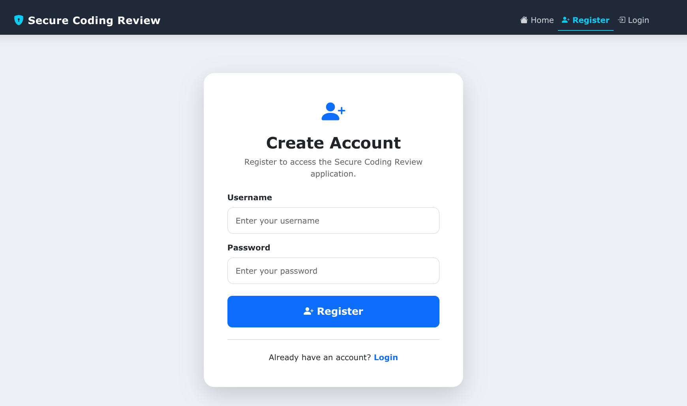

---

## 3️⃣ Login Page

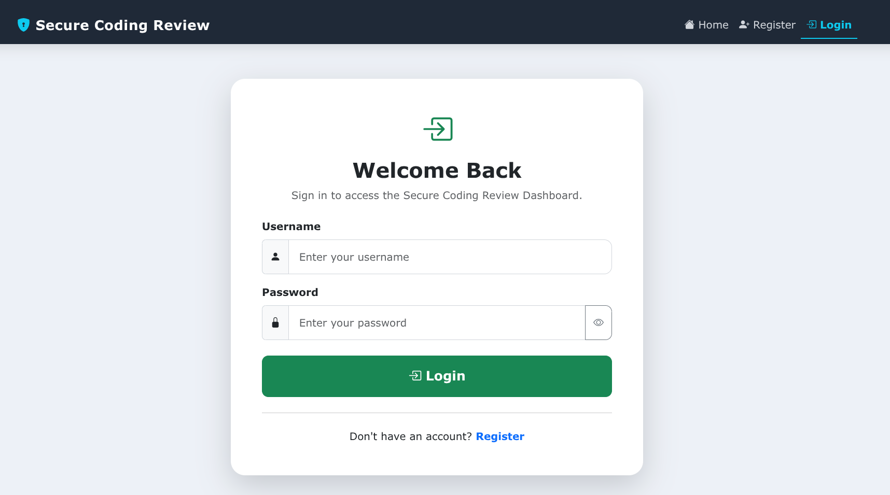

---

## 4️⃣ Dashboard

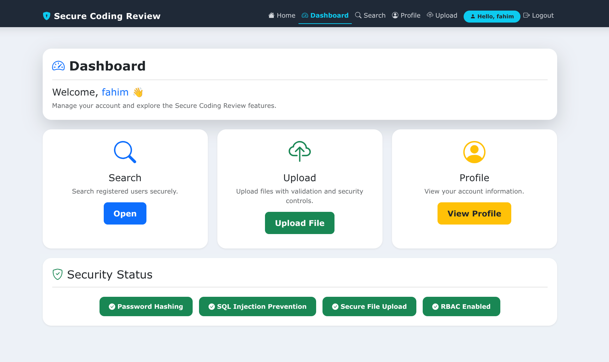

---

## 5️⃣ Secure User Search

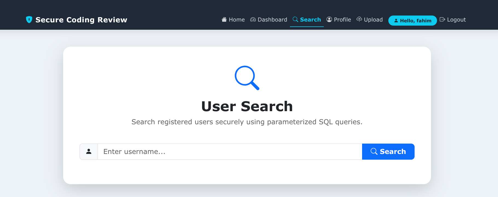

---

## 6️⃣ Search Results

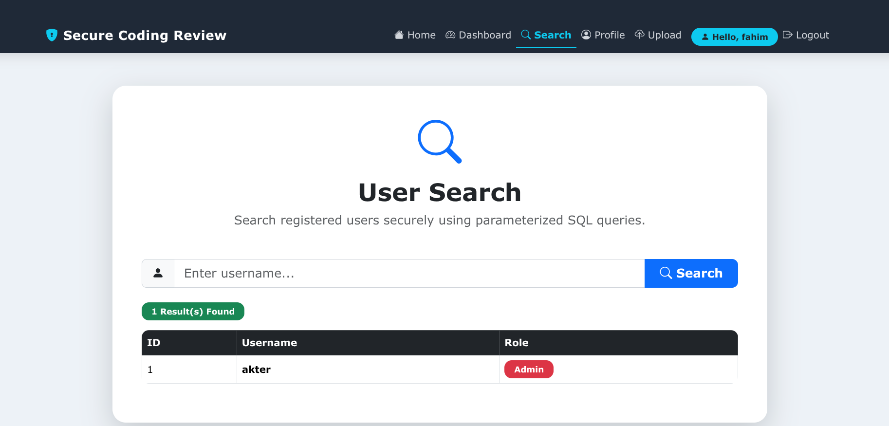

---

## 7️⃣ User Profile

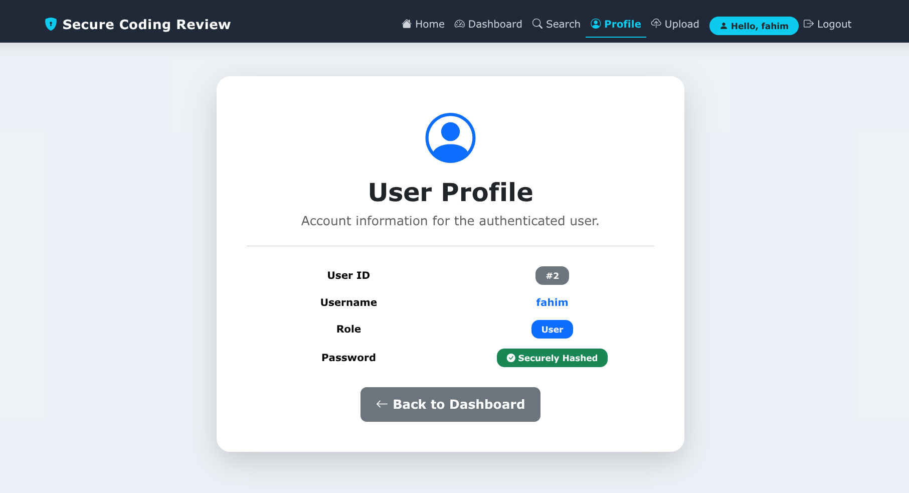

---

## 8️⃣ Secure File Upload

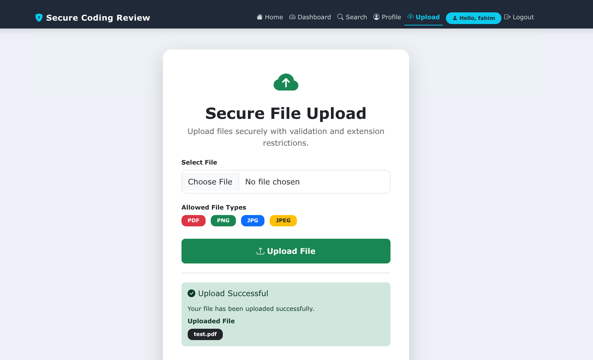

---

## 9️⃣ Admin Panel (RBAC)

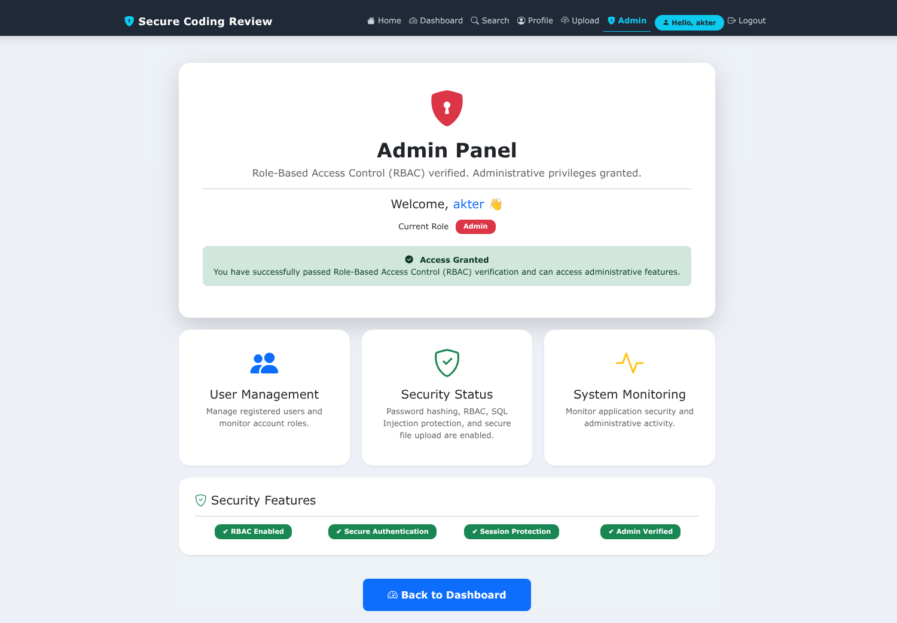

---

## 🔟 Access Denied (403)

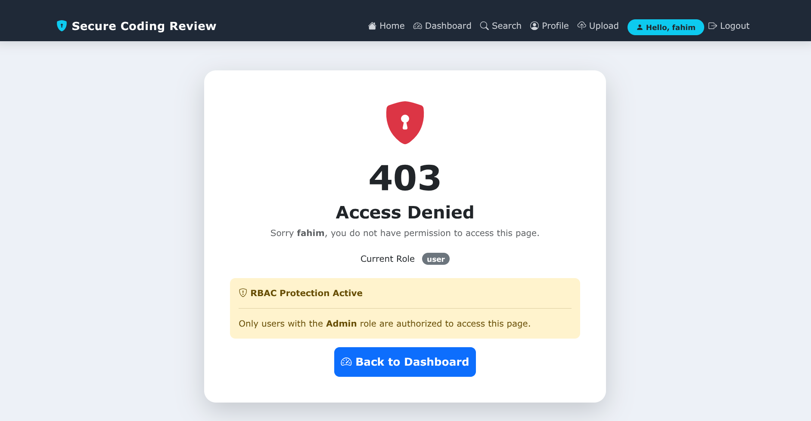

---

## 1️⃣1️⃣ Bandit Security Report

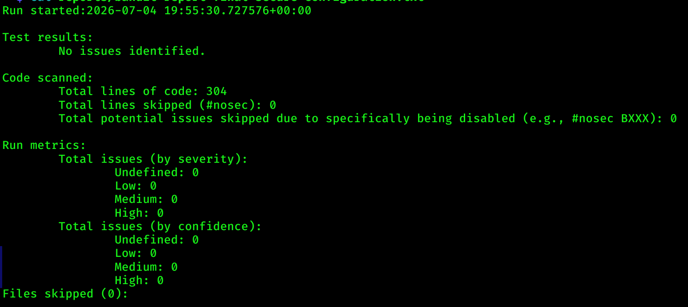

---

## 1️⃣2️⃣ Semgrep Security Report

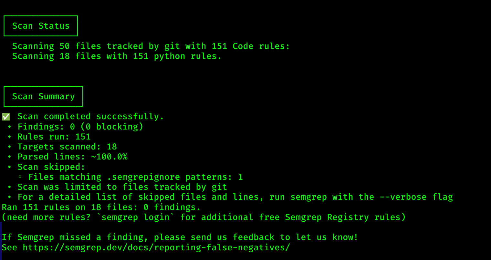

---


# 📂 Project Structure

The project follows a modular Flask architecture, separating authentication, authorization, user management, file upload, and administrative functionalities into individual modules for better maintainability and scalability.

```text
CodeAlpha-Secure-Coding-Review/
│
├── app/
│   ├── admin/                 # Admin routes (RBAC)
│   ├── auth/                  # Login & Registration
│   ├── main/                  # Home & Dashboard
│   ├── profile/               # User Profile
│   ├── search/                # Secure User Search
│   ├── upload/                # Secure File Upload
│   │
│   ├── static/
│   │   ├── css/               # Bootstrap & Custom Styles
│   │   └── js/                # JavaScript Files
│   │
│   ├── templates/             # Jinja2 HTML Templates
│   ├── uploads/               # Uploaded Files
│   │
│   ├── app.py                 # Flask Application Entry Point
│   ├── config.py              # Application Configuration
│   └── database.db            # SQLite Database
│
├── docs/                      # Security Reports & Documentation
├── reports/                   # Bandit & Semgrep Reports
├── scans/                     # Scan Results
├── screenshots/               # README Screenshots
├── .env                       # Environment Variables
├── .gitignore
├── LICENSE
├── README.md
└── requirements.txt
```


# 🛡️ Security Features

- Password Hashing
- SQL Injection Prevention
- Role-Based Access Control (RBAC)
- Secure File Upload
- Session-based Authentication
- Protected Routes
- Bandit Security Scan
- Semgrep Static Analysis

---

# 🔍 Security Analysis

The project was reviewed using both **manual code inspection** and **static application security testing (SAST)** tools.

## Bandit

Bandit was used to analyze the Python source code for common security issues.

**Result**

- ✅ No issues identified
- ✅ 304 lines scanned
- ✅ Low: 0 | Medium: 0 | High: 0

---

## Semgrep

Semgrep was used to perform static security analysis.

**Result**

- ✅ Scan completed successfully
- ✅ 151 Rules Executed
- ✅ 18 Files Scanned
- ✅ 0 Findings

---

# 🌿 Branches

This repository is maintained using separate Git branches for development and the final secure implementation.

| Branch | Purpose |
|----------|----------|
| `master` | Initial project implementation |
| `secure-version` | Final secure version with security enhancements, RBAC, password hashing, SQL Injection prevention, secure file upload, Bandit, and Semgrep fixes |

Switch branches

```bash
git checkout master
```

or

```bash
git checkout secure-version
```

---

### Branch Comparison

| Feature | master | secure-version |
|----------|:------:|:--------------:|
| Authentication | ✅ | ✅ |
| Password Hashing | ❌ | ✅ |
| SQL Injection Prevention | ❌ | ✅ |
| Secure File Upload | ❌ | ✅ |
| Role-Based Access Control (RBAC) | ❌ | ✅ |
| Admin Panel | ❌ | ✅ |
| 403 Access Denied | ❌ | ✅ |
| Bandit Clean Report | ❌ | ✅ |
| Semgrep Clean Report | ❌ | ✅ |

---

# 💻 Technologies Used

| Technology | Purpose |
|------------|----------|
| Python | Backend Development |
| Flask | Web Framework |
| SQLite | Database |
| Bootstrap 5 | User Interface |
| HTML5 | Frontend |
| CSS3 | Styling |
| Werkzeug | Password Hashing |
| Bandit | Static Security Analysis |
| Semgrep | Static Application Security Testing |
| Git & GitHub | Version Control |

---

# 🚀 Future Improvements

- JWT Authentication
- Multi-Factor Authentication (MFA)
- Docker Support
- REST API
- Audit Logging
- CI/CD Pipeline

---

# 🤝 Contributing

Contributions are welcome.

1. Fork the repository.
2. Create a feature branch.
3. Commit your changes.
4. Push the branch.
5. Open a Pull Request.

Please ensure that code follows secure coding best practices and project documentation is updated when necessary.

---

# 📄 License

This project is licensed under the **MIT License**.

See the **LICENSE** file for more details.

---

# 👨‍💻 Author

**Sahadat Hossain**

Cybersecurity Enthusiast

- 📧 Email: pentester.sahadathossain@gmail.com
- 💼 LinkedIn: [Sahadat Hossain](https://www.linkedin.com/in/pentester-sahadat-hossain/)
- 🐙 GitHub: [sahadatx](https://github.com/sahadatx)

---

# ⭐ Support

If you found this project helpful:

- ⭐ Star this repository
- 🍴 Fork the project
- 📢 Share it with others

---

---

<div align="center">

Developed with ❤️ using **Python**, **Flask**, and **Bootstrap**

**CodeAlpha Cyber Security Internship**

⭐ If you found this project useful, please give it a Star.

</div>